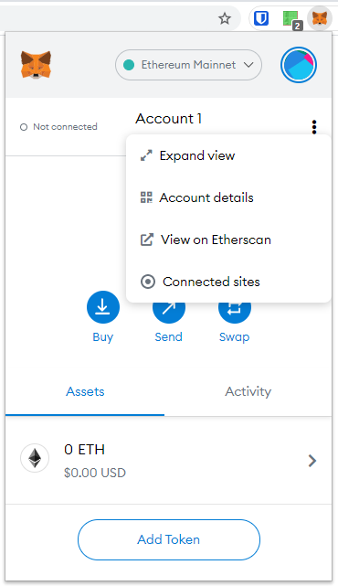
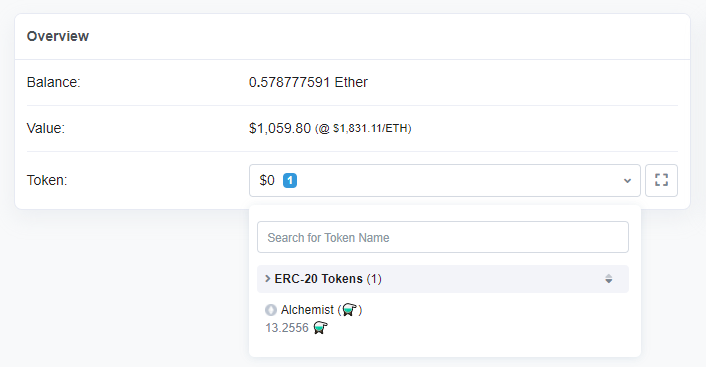
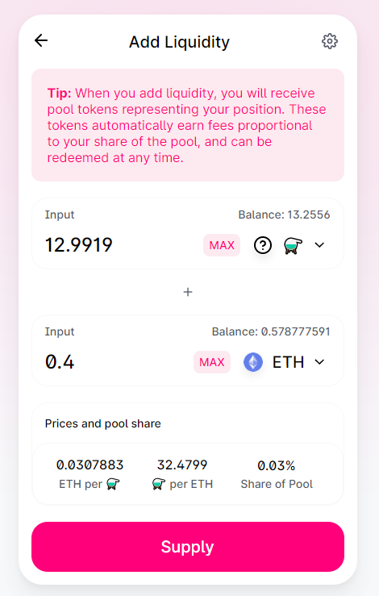
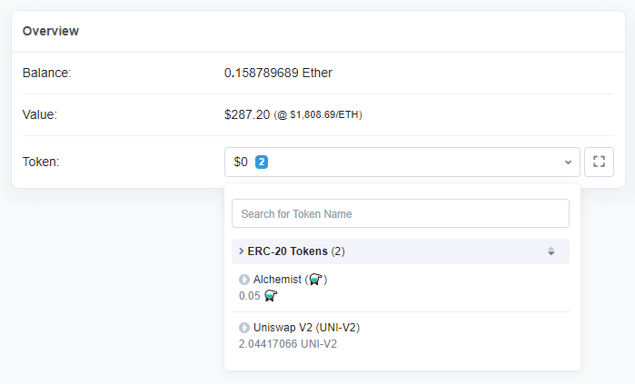

# Acquiring ⚗️ & Adding Liquidity

### 1. Getting $MIST ⚗️

Ever traded coins on mistX.io? If so you know how to do this already.


We recommend using [mistX.io](https://mistx.io) when trading $MIST as it will protect you from being front run. It also provides free cancellations and reverts and you may even win Cashback.&#x20;


1. Head to [Swap $MIST on mistX.io](http://swap.alchemist.wtf)
2. Connect MetaMask wallet
3.  You should see something like this:

    &#x20;&#x20;
4. Enter the amount of ⚗️ you wish to purchase, ensuring you have an equivalent value of ETH remaining to use for the subscribing
5. Hit "Swap", make necessary approvals via MetaMask, wait for the transaction to complete
   * mistX has the ability to let you increase the success rate of a transaction by clicking the Setting icon and choosing to pay a higher transaction fee.
6. Navigate to [https://etherscan.io/address/](https://etherscan.io/address/) to view pending transactions and all tokens associated with your account.
   *   if you use MetaMask you can click the triple dots and then "View on Etherscan" to jump to it:

       
7.  You should see your new ⚗️ displayed like the following:

    &#x20;

### 2. Subscribing $MIST ⚗️ to receive LP tokens

Ever provided liquidity on Uniswap? If so you know how to do this already.


Crucible only supports the **Uniswap V2** Liquidity Pool. \
Adding liquidity to the **Uniswap V3** pool is not compatible with the Rewards Program.


1. Head to [Add LP to $MIST on Uniswap V2](https://app.uniswap.org/#/add/v2/0x88acdd2a6425c3faae4bc9650fd7e27e0bebb7ab/ETH)
   * Connect MetaMask wallet if not already done so
2.  You should see something like this:

    &#x20;
3. Enter the amounts you want to stake. Both sides need to be equal value, so changing one will change the other. You most likely just want to click the "MAX" button on the ⚗️ side
4. Hit "Stake" or "Supply", make necessary approvals via MetaMask, wait for the transaction to complete
5.  You should see your new LP tokens (named UNI-V2) on Etherscan again:

    &#x20;

##
