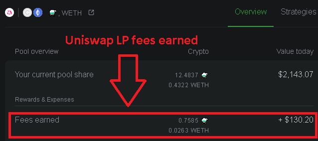

# Frequently Asked Questions



## **How do I participate in a reward program / How do I mint a Crucible NFT?**


Crucible only supports the **Uniswap V2** Liquidity Pool. Adding liquidity to the **Uniswap V3** pool is not compatible with the Rewards Program.



**Precautions**

Do not use Brave browser as it is not compatible with the process at this time and your transaction will fail, resulting in lost fees.

We do not recommend using a hardware wallet at this time as many do not currently support EIP-712 signing. When they fix this, we can implement it.

Some users have reported issues with Trustwallet.

We do not recommend you do this on a mobile.


Please use the guide [How do I mint a Crucible?](guides-1/how-do-i-mint-a-crucible.md) to learn more about this process.

## **Why can’t I see my ⚗️Mist in my wallet?**

You can add the contract address **`0x88acdd2a6425c3faae4bc9650fd7e27e0bebb7ab`** to make them visible.  
Token Symbol: ⚗️  
Token Decimal: 18

## **Why can’t I see my LP in my wallet?**

You can add the contract address **`0xcd6bcca48069f8588780dfa274960f15685aee0e`** to make them visible.  
Token Symbol: UNI-V2  
Token Decimal: 18

## **Why can’t I see my Crucible in my wallet?**

You can add the contract address **`0x54e0395CFB4f39beF66DBCd5bD93Cca4E9273D56`** to make your Crucible\(s\) visible.  
Token Symbol: CRUCIBLE-V1  
Token Decimal: 0

## **How do I become an certified Alchemist in Discord?**

* Please use this [guide](how-to-become-a-certified-alchemist-on-discord.md)
* Join Discord
* Go to the Welcome channelType !join
* You will then get a message from the Collab.Land bot
* Connect Your wallet containing your ⚗️ $mist
* The bot will then message you  ~ Updating roles, Please check assigned roles in Alchemist
* Close bot and return to the main alchemy channel and you will now be a certified Alchemist!

## **How do I claim the rewards?**

All rewards are received when you [Claim Rewards and Unsubscribe LP](guides-1/claiming-rewards-and-unsubscribing-your-tokens.md) in full. Be careful, this also resets your reward multiplier.

## **Does it matter how many tokens go into the Crucible?**

The more tokens that are 'subscribed' to a reward program the larger percentage of the rewards pool you will receive. There is no minimum amount required, but we do suggest you be mindful of the ethereum gas cost when considering this.

Adding ERC20 tokens into your Crucible that are not subscribed to a program will not gain you any additional rewards.

## **Is it more advantageous to have more Crucibles or a higher Subscription in one Crucible?**

It’s almost always better to accumulate LP in a single Crucible as it minimizes the gas costs.

The only time you would use multiple Crucibles is if you aim to transfer / sell a Crucible with or without an active LP subscription on it.

## What is the maximum number of crucibles that can be created? 

An unlimited number of crucibles can be created. Please note that if you visit [etherscan, ](https://etherscan.io/token/0x54e0395cfb4f39bef66dbcd5bd93cca4e9273d56)please disregard the word "Max" in "Max Total Supply" because the supply is unlimited. The "Max Total Supply" shown on etherscan simply indicates the total number crucibles created so far.

## **How does unsubscribing impact the reward multiplier?**

Every time you put tokens into a reward program, it keeps track of how long those tokens are Subscribed. The program then applies a reward multiplier \(if applicable\). When you claim a partial amount, the reward program first claims from the Subscription with the lowest multiplier \(Last In, First Out\).

## **Can I somehow see how much rewards I have acquired in the meantime?**

You can see the accumulated reward for your crucible by using the UI at [crucible.alchemist.wtf](https://crucible.alchemist.wtf/) and the accumulated Uniswap LP fees earned using [apy.vision](https://apy.vision/) or [croco.finance](https://croco.finance/) \(Uniswap LP fees earned will show as ⚗️, and WETH or ETH\).

## **Can I add more LP to an existing Crucible?**

Yes. The gas for adding more LPs to your current Crucible will be much lower than when you initially minted a Crucible. Each Subscription event is independent, so any LP you add will start their own multiplier independently.  Subscribing more LP will not reset any other reward multiplier.

## **Does “Claim & Unsubscribe” remove my tokens & rewards from the Crucible?**

No. This only claims the rewards earned, your LP will remain in the Crucible until you use the Assets Management tab to withdraw your tokens.

## **Does withdrawing all tokens destroy the Crucible?**

No, it only empties it. You retain the empty Crucible. Please note that after a crucible is created, it cannot be destroyed.

## **Can I transfer the Crucible NFT to another wallet?**

Yes, the ownership of the NFT \(and the Subscribed LP tokens\) can be transferred to any ERC721 compatible wallet. This can be done via the "[Transfer](guides-1/what-can-i-do-with-my-new-crucible.md#transferring-your-crucible-to-another-wallet)" option on [crucible.alchemist.wtf](https://crucible.alchemist.wtf/)

## **If I transfer my Crucible from one wallet to another will that reset the multiplier?**

No, as long as the rewards are not unsubscribed from the reward program.

