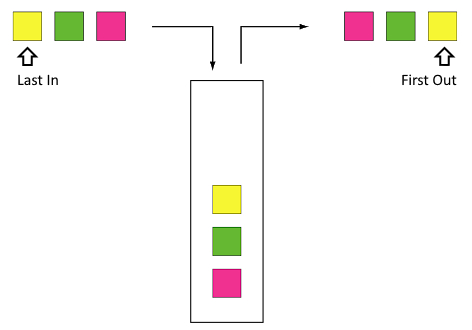

# Frequently Asked Questions


Please watch this Video on Impermanent loss before subscribing LP


## **How do I participate in a reward program / How do I mint a Crucible NFT?**

Please use the guide [How do I mint a Crucible?](guides/how-do-i-mint-a-crucible.md) to learn more about this process.

## **Why can’t I see my ⚗️Mist in my wallet?**

You might need to add the contract address to your wallet to make them visible.

Contract address: **`0x88acdd2a6425c3faae4bc9650fd7e27e0bebb7ab`**\
Token Symbol: ⚗️\
Token Decimal: 18

## **Why can’t I see my MIST-WETH LP in my wallet?**

You might need to add the contract address to your wallet to make them visible.

Contract address: **`0xcd6bcca48069f8588780dfa274960f15685aee0e`**\
Token Symbol: UNI-V2\
Token Decimal: 18

## **Why can’t I see my Crucible in my wallet?**

You might need to add the contract address to your wallet to make them visible.

Contract Address: **`0x54e0395CFB4f39beF66DBCd5bD93Cca4E9273D56`**\
Token Symbol: CRUCIBLE-V1\
Token Decimal: 0

## **How do I become a certified Alchemist in Discord?**

* Please use this [guide](how-to-become-a-certified-alchemist-on-discord.md)

## **How do I claim the rewards?**

Rewards are received when you [Claim Rewards and Unsubscribe](guides/claiming-rewards-and-unsubscribing-your-tokens.md). You can claim partial rewards by unsubscribing only a partial balance. Your multiplier will be reset for the portion of tokens that you unsubscribe.

## **Does it matter how many tokens go into the Crucible?**

The more tokens that are 'subscribed' to a reward program the larger percentage of the rewards pool you will receive. There is no minimum amount required, but we do suggest you be mindful of the ethereum gas cost when considering this.

Adding ERC20 tokens into your Crucible that are not subscribed to a program will not gain you any additional rewards.

## What is the maximum number of Crucibles that can be created?&#x20;

The supply of Crucibles has not been restricted.

## **How does unsubscribing impact the reward multiplier?**

Every time you put tokens into a reward program, it keeps track of how long those tokens are Subscribed. The program then applies a reward multiplier (if applicable). When you claim a partial amount, the reward program first claims from the Subscription with the lowest multiplier (Last In, First Out).

## **How does the multiplier work?**

The multiplier is a release mechanism that will scale your rewards until you reach the full portion of the pool that you're entitled to.

Using `Aludel v1.5` as an example; the program has a max multiplier of `10x` a minimum multiplier of `1x` and a scaling period of `60 days`.

Let's say you have `10 LP` tokens currently staked and there is a total of `1000LP` tokens staked to the pool, this means you have staked `1%`  of the total staked amount in the program. That means that you should be eligible to `1%` of the tokens that are available in the program.

However when you start, you are at `1x` of your multiplier, what this means is that you would be entitled to `% of total stake * min multiplier / max multiplier = your current eligibility` or `1% * 1/10 = 0.1%` of the pool.

Let's assume the pool has `100 MIST` tokens, at `1x`  you would be entitled to 0.1 MIST tokens and at `10x` you would be entitled to `1 MIST` token.

Every second you are in the pool during the scaling period of `60 days`, the portion of the pool that you are eligible for grows towards your full eligibility. The calculation has a direct impact to the amount of rewards that are displayed to you and is always represented in the amount of rewards displayed.

To work out what percentage is available to you at any time, you can work out your multiplier with the following formula:\
`((your max percentage of pool * duration staked days * (max multiplier - 1))/max multiplier)/scaling period days) + (your max percentage of pool * (1/max multiplier))`&#x20;

With the example above, at 10 days you would be eligible to `0.25%` of the pool, at 40 days you are eligible to `0.7%` of the pool&#x20;

`1%*10*(9)/10/60+(1%*(1/10)) = 0.25%`

Once you reach `10x` you would be entitled to 1 MIST from that balance. If another 100 MIST gets dropped into the program and is fully released (deposits have their own release mechanism) - then you will be eligible for 2 MIST in total (1 MIST from before and 1 MIST from the newest deposit)

These examples are on the assumption that the participation of the pool doesn't change, but simple enough to demonstrate how the multiplier works.

## **Can I somehow see how much rewards I have acquired in the meantime?**

You can see the accumulated reward for your crucible by using the UI at [crucible.wtf](https://crucible.wtf) and the accumulated Uniswap LP fees earned using [apy.vision](https://apy.vision) or [croco.finance](https://croco.finance) (Uniswap LP fees earned will show as ⚗️, and WETH or ETH).

## **Can I add more tokens to an existing Crucible?**

Yes, your Crucible is able to hold an infinite amount of tokens. If you are adding tokens to an existing subscription, each Subscription event is independent, so any token you add will start their own multiplier independently.  Subscribing more tokens will not reset any other reward multipliers that are already in play.

## **Does “Claim & Unsubscribe” remove my tokens & rewards from the Crucible?**

No. This only claims the rewards earned, your tokens will remain in the Crucible until you use the Assets Management tab to withdraw your tokens.

## **Does withdrawing all tokens destroy the Crucible?**

No, it only empties it. You retain the empty Crucible. Please note that after a Crucible is created, it cannot be destroyed.

## **Can I transfer the Crucible NFT to another wallet?**

Yes, the ownership of the NFT (and the Subscribed LP tokens) can be transferred to any ERC721 compatible wallet. This can be done via the "[Transfer](guides/what-can-i-do-with-my-new-crucible.md#transferring-your-crucible-to-another-wallet)" option on [crucible.wtf](https://crucible.wtf)

## **If I transfer my Crucible from one wallet to another will that reset the multiplier?**

No, transferring your Crucible does not affect anything. All underlying token balances and subscriptions will remain in tact and in the control of the new owner.
