# Claiming Rewards & Unsubscribing your Tokens

At some point you may decide that you are ready to Claim your rewards and Unsubscribe your tokens from a reward program

The guide below is designed to step you through that process.


Please note that when you unsubscribe all of the staking token or only a portion of your staking token from the crucible, the reward multiplier for the unsubscribed staking tokens will be reset while the subscribed portion will remain at its current multiplier.&#x20;

For example, suppose you have 1.7 ⚗️-WETH LP subscribed and its reward multiplier is at 10x. You decide to unsubscribe 1 ⚗️-WETH LP. The 0.7 ⚗️-WETH LP remaining (still subscribed) will continue to have a reward multiplier of 10x, while the unsubscribed 1 ⚗️-WETH LP's reward multiplier will be reset.&#x20;

The rewards you receive will be from the unsubscribed 1 ⚗️-WETH LP, not the subscribed 0.7 ⚗️-WETH LP.


1. To claim your rewards and unsubscribe your tokens open [crucible.alchemist.wtf](https://crucible.alchemist.wtf), connect your wallet and visit "Your Crucibles" tab.\

2.  Once on the "Your Crucibles" tab, locate the locked token that you wish to claim rewards for on the summary page and click the  icon and click 'View \<Reward Program> Rewards'\

    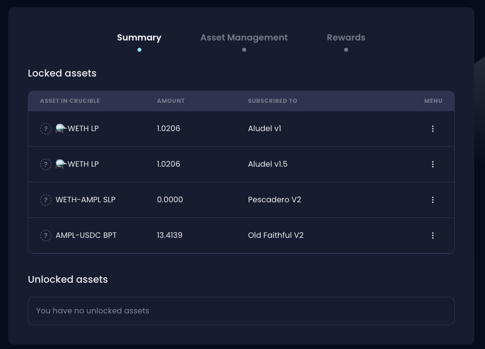\
     \

3. Your Crucible should now show you some more information, such as how much you have earned in rewards and your current position within the reward program \
   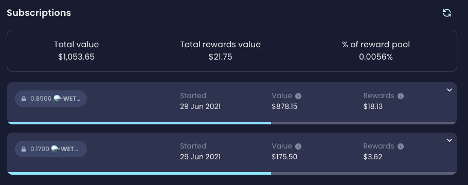 \

4. Either expand the subscription and click 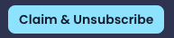 or click "Unsubscribe" on the actions section of the reward program.\
   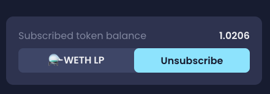 \

5. Fill in the prompt with how much LP you wish to unsubscribe and Click "Claim rewards and unsubscribe".\
   \
   If you have more than 1 subscription, you can use the visual representation to see how your rewards will be unsubscribed (as it is done on a last in, first out basis) for each subscription that you have.\
   \
   You can even click the number next to the subscription line in order to select the subscription level you wish to unsubscribe.\
   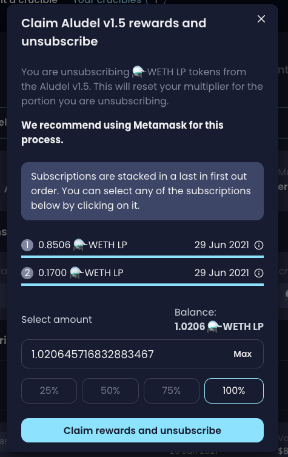 \

6. You will need to sign the first signature request, then you will be able to see the transaction cost for unsubscribing, pressing cancel will stop the process happening. If you agree and press Ok, you will be given a second signature request, click Sign.\
   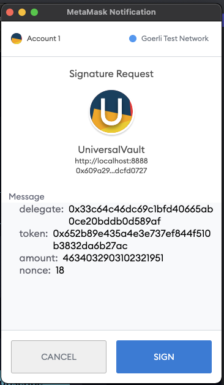 \
   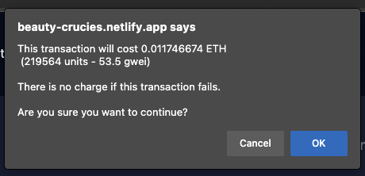 \
   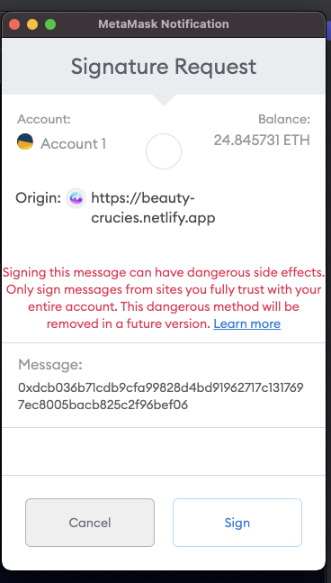 \

7.  You will now get a message indicating that your claim is now being submitted via Flashbots. This is to protect your rewards from frontrunners. The process may take up to 5 minutes to complete.

    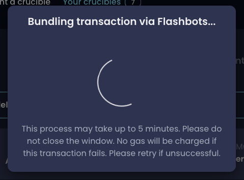\
    \
    If you do not have enough ETH in your wallet for the transaction, you will receive a message as below.\
    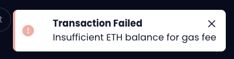\

8. If your transaction is successful you will get the message below.\
   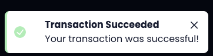


Due to the nature of bundling transactions, it's possible the transaction may not be successful on your first attempt. If this is the case, please try again.&#x20;

The gas fee will only be charged if there is a successful transaction.

**If the transaction fails, you will not be charged a gas fee.**

