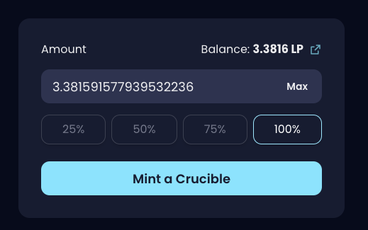
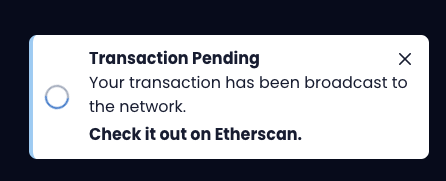
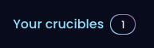

# How do I mint a Crucible?



## Swapping and Subscribing $MIST ⚗️ to mint a Crucible

First of all, you need to have ⚗️-WETH LP from the [Uniswap-V2 Liquidity pool](https://lp.mist.alchemist.wtf).

If you have not done this already, please refer to our 2-part guide on [Acquiring ⚗️ & Adding Liquidity](../acquiring-and-adding-liquidity.md).

## Minting a Crucible using ⚗️-WETH LP tokens


**Important information:** 

Do not use Brave browser as it is not compatible with the process at this time and your transaction will fail, resulting in lost fees. 

The only currently compatible hardware wallet is Ledger, many others do not currently support EIP-712 signing. When other hardware wallets implement this feature they will become compatible.


### Step by Step guide

1. Firstly head to [crucible.alchemist.wtf](https://crucible.alchemist.wtf/)
2. Click on the "Mint a crucible" link
3. Connect a wallet using the "Connect Wallet" button. For this example we will use Metamask

    - or -   

4. You should see something like this:

     

5. If you do not have ⚗️-WETH LP you will receive a notice below. If this is the case, please visit the [Acquiring ⚗️ & Adding Liquidity](../acquiring-and-adding-liquidity.md) page for obtaining the LP token.   
6. Enter the amount of LP you wish you put into the Crucible. You probably wish to click "Max" to enter your full amount    
7. Hit "Mint a Crucible", make necessary approvals via MetaMask, wait for the transaction to complete. **Note: There should be 2 signing requests and a transaction request, if they do not pop up you might have to open MetaMask.**            
8. Once you have Confirmed your transaction you should receive the following prompts, click to view your transaction. Once your transaction has been confirmed, please move to the next step.      
9. Now your transaction is confirmed, click on the "Your crucibles" tab, this should show your newly minted crucible       

## **Congratulations, if you've made it this far, you're now an Alchemist**

