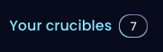
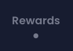
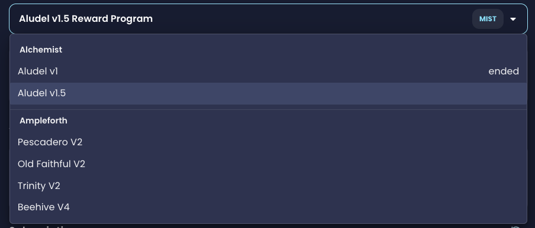
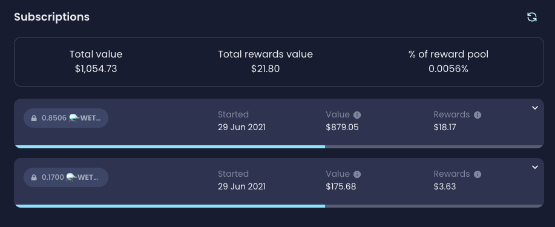
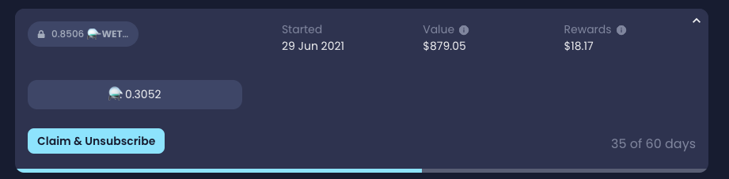
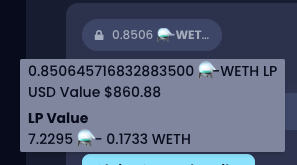
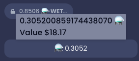

# Viewing your reward performance

You can now see the performance of your individual subscriptions within a reward program, so you can keep a better track of your rewards.

We've built the page in a way that you have a summary of each subscription and you can further expand it in order to see the individual rewards.

## Viewing a specific subscription

1. Open the Your Crucibles page   
2. Locate the crucible you want to view, and click on it if its not already selected    
3. You can either click on the "Rewards Tab" or click on the menu of the Locked asset within the "Summary" tab and select the relevant reward program.   
4. Chose the Reward Program you wish to view from the Purple Dropdown menu   
5. Scroll down to "Subscriptions"     You can now see your individual subscriptions at an overview, and see how they are performing in terms of rewards, the cyan bar at the bottom of your subscription represents your multiplier growth against the scaling period. 
6. Expand the individual subscription you wish to view by clicking on it, the exact rewards you have earned in that subscription     You can now also see the amount of days your subscription has existed for.

## Viewing your LP token balances

Follow steps 1-4 in [Viewing a specific subscription](viewing-your-reward-performance.md#viewing-a-specific-subscription) above, you can hover over \(or tap on when using mobile\) the locked balance of your subscription. A tooltip will appear showing you the balance of that LP token.   
  

## Viewing a specific Reward Token value

1. Follow steps 1-6 in [Viewing a specific subscription](viewing-your-reward-performance.md#viewing-a-specific-subscription) above
2. Locate the reward token you wish to view the value for and hover over \(or tap on when using mobile\) the  balance. A tooltip will appear showing you the balance of that LP token.  

