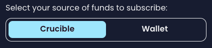

# What can I do with my new Crucible?

There are a number of things you can do with your newly minted crucible, below are the most common things that you can do using [crucible.wtf](https://crucible.wtf)

* [Checking your rewards](what-can-i-do-with-my-new-crucible.md#checking-your-rewards)
* [Increasing your Subscription Stake](what-can-i-do-with-my-new-crucible.md#increasing-your-lp-subscription)
* [Checking balances of current subscriptions or token balances within to your Crucible](what-can-i-do-with-my-new-crucible.md#checking-how-much-lp-youve-subscribed-to-your-crucible)
* [Transferring your Crucible to another wallet](what-can-i-do-with-my-new-crucible.md#transferring-your-crucible-to-another-wallet)
* [Locating and Copying your Crucible Address](what-can-i-do-with-my-new-crucible.md#locating-and-copying-your-crucible-address)
* [Viewing your Crucible Artwork](what-can-i-do-with-my-new-crucible.md#viewing-your-crucible-artwork)
* [Sharing your Crucible Contents and/or Artwork](what-can-i-do-with-my-new-crucible.md#undefined)

## Checking your rewards

1. Open [crucible.wtf](https://crucible.wtf) connect your wallet and visit "Your Crucibles" tab.
2. Once on the "Your Crucibles" tab, click on the crucible that you want to view the rewards from.\
   &#x20;
3. Your Crucible should now show you a summary of its contents, it will also show you your "Locked" tokens, which represent your active subscriptions\
   .png>)
4. If you want to see more detailed rewards, click on the  button next to the relevant subscription and then click "View \<Reward Program> Rewards" \
    \
   &#x20;
5. You should now be shown a more complex list of statistics under the tab "Rewards", including information about the reward multiplier, the value of your positions and your subscribed & unsubscribed LP.\
   &#x20;

## Increasing your Subscription Stake


This example is based on Aludel v1.5. Other reward programs may use different types of tokens for subscribing.


1. Follow steps 1 - 5 from [Checking your Rewards](what-can-i-do-with-my-new-crucible.md#checking-your-rewards)
2. Click the "Subscribe" button \
   
3. Select whether you want to add your subscription from your Crucible or Wallet \
   &#x20;
4. Specify how much LP you wish to increase your subscription by and press "Add Subscription" \
   &#x20;
5. Sign 1 signature requests and confirm the transaction request. .png>)&#x20;
6. Your LP should now be submitted to be subscribed to the Crucible, you can view your transaction using either of the prompts that appear after your transaction has been submitted\
   &#x20;.png>) \
   &#x20;
7. Once the transactions are complete, your Crucible should now contain your newly submitted LP. \
   &#x20;

## Checking balances of current subscriptions or token balances within your Crucible

1. Open [crucible.wtf](https://crucible.wtf), connect your wallet and visit "Your Crucibles" tab.
2. Once on the "Your Crucibles" tab, click on the crucible that you want to view the rewards from.\
   &#x20;
3. Your Crucible should now show you a summary of its contents\
   \
   `Locked Assets` are tokens that are currently subscribed to reward programs and are unable to be moved away from your Crucible until they are unsubscribed from the programs that they are locked to.\
   \
   `Unlocked Assets` are tokens within your Crucible that are currently free to be transferred in or out of your Crucible.\
   \
   .png>)

## Transferring your Crucible to another wallet

You can transfer your Crucible to another wallet without affecting the tokens that are within it or the active subscriptions. Everything within the Crucible will be maintained.

1. Open the "Your Crucibles" page
2. Locate your Crucible on the left hand side that you wish to transfer, and click the icon
3. Click the "Transfer" option on the menu that has popped up\
   &#x20;
4. Enter the wallet address you wish to send the Crucible to in the "Recipient Address" field (Must be ERC-721 Compatible) and press "Transfer Crucible"\
   &#x20;
5. You will get prompted to confirm the transfer, make sure the wallet address is correct before submitting it. \
   &#x20;
6.  The Crucible will now be on its way to its new wallet, use the links in the notifications to monitor the transaction.

    .png>)

    &#x20;

## Locating and Copying your Crucible Address

1. Open the "Your Crucibles" page.
2. Locate the Crucible that you want to copy the address from and click the  icon
3. Click the "Copy" option on the menu that pops up and your Crucible address will now be in your Clipboard. \
   &#x20;

## Viewing your Crucible artwork

You can now view your Crucible either on the Crucible website or on most NFT websites. Use the guides below:

* [Opensea.io Guide](what-can-i-do-with-my-new-crucible.md#via-opensea)
* [Crucible.wtf Guide](what-can-i-do-with-my-new-crucible.md#via-crucible.wtf)

### Via Opensea.io

1. Open [opensea.io](https://opensea.io)
2. Connect your wallet
3. Click your user icon in the top right hand corner\
   
4. Locate your Crucible NFT in your collection and select it\
   
5. You can now see your Crucible artwork in the top left hand corner of the screen. \
   \
   Scroll down and you can also view your Crucibles `Properties`, `mint number` and `mint date`. You can also view links to view your Crucible contents on the Crucible website or EtherScan within the `Description` section.&#x20;

### Via Crucible.wtf

1. Open [crucible.wtf](https://crucible.wtf), connect your wallet and visit "Your Crucibles" tab.
2. Once on the "Your Crucibles" tab, click on the crucible that you want to view the rewards from.\
   &#x20;
3. Click on the "View" Tab at the top of the section&#x20;

## Interacting with your Crucible Artwork

Interacting with your Crucible is relatively straight forward and can be done from a computer or mobile device

Use the Viewing your Crucible Artwork section above to load your artwork

You can then click the information icon in the Crucible scene to load the instructions of how to interact with the scene on the device\

Depending on the device you are on, you will either be provided instructions to be used with a mouse or by touch gestures.\

You can also interact with the Crucible directly, for example clicking on the '[Clock](artwork-of-the-crucible.md#33fe)' element of your Crucible ([learn more about Crucible Elements](artwork-of-the-crucible.md#1c5f)) will display the mint time and date for when your Crucible was created and also the Mint number.

There are other various interactions hidden in the Crucible scene waiting to be discovered.

## Sharing your Crucible Contents and/or Artwork

Your Crucible is a work of art and it's only natural to want to share it to the world.

1. Open the "Your Crucibles" page.
2. Locate the Crucible that you want to share from and click the  icon
3. Depending on what information you wanted to disclose, you can choose from one of the 2 options for sharing your Crucible: \
   

`Share (Artwork Only)` = Sharing artwork without disclosing your Crucible address or Crucible contents/subscriptions.

`Share (Full Detail)` = Sharing while disclosing the full token & balance contents, subscriptions, address and artwork of your Crucible.\
\
We recommend using the `Artwork Only` option when sharing your Crucible on public channels.
