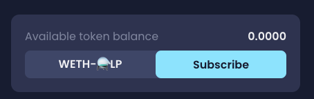

# What can I do with my new Crucible?

There are a number of things you can do with your newly minted crucible, below are the most common things that you can do using crucible.alchemist.wtf

* [Checking your rewards](what-can-i-do-with-my-new-crucible.md#checking-your-rewards)
* [Increasing your LP Subscription](what-can-i-do-with-my-new-crucible.md#increasing-your-lp-subscription)
* [Checking how much LP you've subscribed to your Crucible](what-can-i-do-with-my-new-crucible.md#checking-how-much-lp-youve-subscribed-to-your-crucible)
* [Transferring your Crucible to another wallet](what-can-i-do-with-my-new-crucible.md#transferring-your-crucible-to-another-wallet)
* [Locating and Copying your Crucible Address](what-can-i-do-with-my-new-crucible.md#locating-and-copying-your-crucible-address)

## Checking your rewards

1. Open [crucible.alchemist.wtf](https://crucible.alchemist.wtf/), connect your wallet and visit "Your Crucibles" tab.
2. Once on the "Your Crucibles" tab, click on the crucible that you want to view the rewards from.  
3. Your Crucible should now show you a summary of its contents, it will also show you your "Locked" tokens, which represent your active subscriptions 
4. If you want to see more detailed rewards, click on the  button next to the relevant subscription and then click "View &lt;Reward Program&gt; Rewards"     
5. You should now be shown a more complex list of statistics under the tab "Rewards", including information about the reward multiplier, the value of your positions and your subscribed & unsubscribed LP.  

## Increasing your LP Subscription


This example is based on Aludel v1.5. Other reward programs may use different types of tokens for subscribing.


1. Follow steps 1 - 5 from [Checking your Rewards](what-can-i-do-with-my-new-crucible.md#checking-your-rewards)
2. Click the "Subscribe" button  
3. Select whether you want to add your subscription from your Crucible or Wallet   
4. Specify how much LP you wish to increase your subscription by and press "Add Subscription"   
5. Sign 1 signature requests and confirm the transaction request.  
6. Your LP should now be submitted to be subscribed to the Crucible, you can view your transaction using either of the prompts that appear after your transaction has been submitted     
7. Once the transactions are complete, your Crucible should now contain your newly submitted LP.   

## Checking how much LP you've subscribed to your Crucible

1. Follow steps 1 - 5 from [Checking your Rewards](what-can-i-do-with-my-new-crucible.md#checking-your-rewards)
2. You should be able to see your "Available token balance" and "Unsubscribed token balance"    

## Transferring your Crucible to another wallet

You can transfer your Crucible to another wallet without affecting the tokens that are within it or the active subscriptions. Everything within the Crucible will be maintained.

1. Open the "Your Crucibles" page
2. Locate your Crucible on the left hand side that you wish to transfer, and click the icon
3. Click the "Transfer" option on the menu that has popped up  
4. Enter the wallet address you wish to send the Crucible to in the "Recipient Address" field \(Must be ERC-721 Compatible\) and press "Transfer Crucible"  
5. You will get prompted to confirm the transfer, make sure the wallet address is correct before submitting it.   
6. The Crucible will now be on its way to its new wallet, use the links in the notifications to monitor the transaction.

   

    

## Locating and Copying your Crucible Address

1. Open the "Your Crucibles" page.
2. Locate the Crucible that you want to copy the address from and click the  icon
3. Click the "Copy" option on the menu that pops up and your Crucible address will now be in your Clipboard.   

