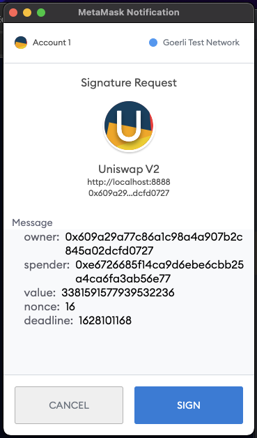

# How do I mint a Crucible?


Not a fan of reading? Use the community created video guide above on how to mint a Crucible for a quick and easy introduction.


## How to Mint a Crucible

There are several options to mint a Crucible:

| Crucible                                                                     | Requirements                 | Artwork | Benefits                                 | Upgradeable |
| ---------------------------------------------------------------------------- | ---------------------------- | :-----: | ---------------------------------------- | ----------- |
| [Basic Crucible](how-do-i-mint-a-crucible.md#minting-a-basic-crucible)       | Gas only                     |    ⤫    | Reward Programs                          | ✓ Pro       |
| [Pro Crucible](how-do-i-mint-a-crucible.md#minting-a-pro-crucible)           | 
0.05 ETH + Gas
     |    ✓    | 
Reward Programs + Crucible Key
 | ⤫           |
| [Platinum Crucible](how-do-i-mint-a-crucible.md#minting-a-platinum-crucible) | 
MIST-WETH LP + Gas
 |    ✓    | 
Reward Programs + Crucible Key
 | ⤫           |


**Important information:**&#x20;

The only currently compatible hardware wallet is Ledger when used with MetaMask.


## Minting a Basic Crucible

Minting a Basic Crucible is very straight forward and can be done via the "[Mint a Crucible](https://crucible.alchemist.wtf/mint)" page on the [crucible.wtf](https://crucible.alchemist.wtf/mint) website.

1. Open [Crucible.wtf](https://crucible.wtf)
2. Connect your wallet
3. Click "Mint a Crucible" in the header\
   
4. Click "Select" under the "Basic Crucible" card\
   
5. Click "Mint a Crucible" button at the bottom of the modal.\
   
6. Review the Gas costs on the transaction notification and confirm the transaction once you're ready to proceed\
   
7. Wait for the transaction to be successful\
   
8. Once your Crucible has been successfully minted, you can click the "Manage your Crucible" link to open your new Crucible directly. \
   \
   \
   You can also use the "Your crucibles" tab, this should show your newly minted crucible \
   &#x20; \
   &#x20;

## Minting a Pro Crucible

Minting a Pro Crucible is very straight forward and can be done via the "[Mint a Crucible](https://crucible.alchemist.wtf/mint)" page on the [crucible.wtf](https://crucible.alchemist.wtf/mint) website.

1. Open [Crucible.wtf](https://crucible.wtf)
2. Connect your wallet
3. Click "Mint a Crucible" in the header\
   
4. Click "Select" under the "Pro Crucible" card\
   
5. Click "Mint a Crucible" button at the bottom of the modal.\
   &#x20;
6. Review the costs on the transaction notification and confirm the transaction once you're ready to proceed, minting a Pro Crucible will cost you 0.05 ETH + Gas costs.\
   
7. Wait for the transaction to be successful\
   
8. Once your Crucible has been successfully minted, you can click the "Manage your Crucible" link to open your new Crucible directly. \
   \
   \
   You can also use the "Your crucibles" tab, this should show your newly minted crucible \
   &#x20; \
   &#x20; 

## Minting a Platinum Crucible

First of all, you need to have MIST-WETH LP from the [Uniswap-V2 Liquidity pool](https://lp.mist.alchemist.wtf).

If you have not done this already, please refer to our 2-part guide on [Acquiring ⚗️ & Adding Liquidity](../acquiring-and-adding-liquidity.md).

Once you've obtained MIST-WETH LP then you can continue to follow the steps below


Your MIST-WETH LP used to mint a Crucible is automatically subscribed to Aludel v1.5. You will not lose any portion of your LP balance during the minting process.


### Step by Step guide

1. Open [Crucible.wtf](https://crucible.wtf)
2. Connect your wallet
3. Click "Mint a Crucible" in the header\
   
4. Click "Select" under the Platinum Crucible Card\
   
5.  You should see a modal like below popup:

    &#x20;
6. If you do not have ⚗️-WETH LP you will receive a notice below. If this is the case, please visit the [Acquiring ⚗️ & Adding Liquidity](../acquiring-and-adding-liquidity.md) page for obtaining the LP token.\
   
7. Enter the amount of LP you wish you put into the Crucible. You probably wish to click "Max" or "100%" to enter your full amount\
   
8. Hit "Mint a Crucible", make necessary approvals via MetaMask, wait for the transaction to complete.\
   \
   **Note: There should be 2 signing requests and a transaction request, if they do not pop up you might have to open MetaMask.** \
   **** \
     \
   &#x20; 
9. Once you have Confirmed your transaction you should receive the following prompts, click to view your transaction. Once your transaction has been confirmed, please move to the next step. \
   \
    \
    \

10. Now your transaction is confirmed, click on the "Your crucibles" tab, this should show your newly minted crucible \
    &#x20; \
     \

## **Congratulations, if you've made it this far, you're now an Alchemist**
