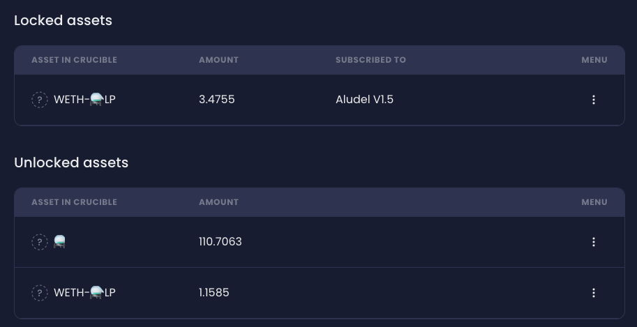
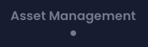
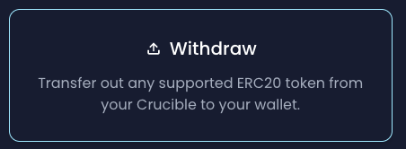
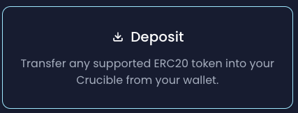
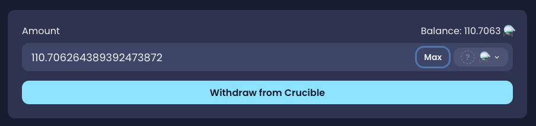
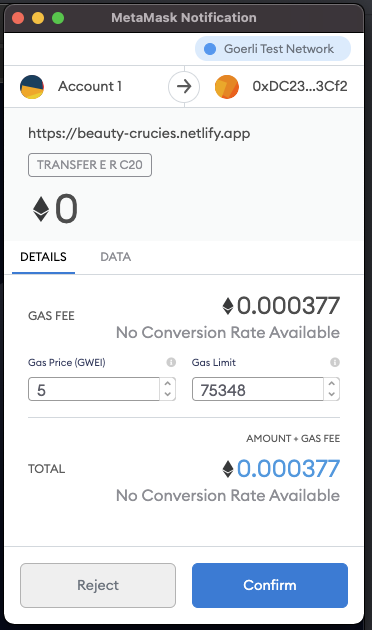
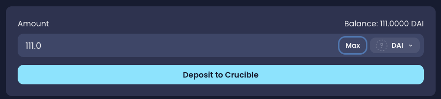
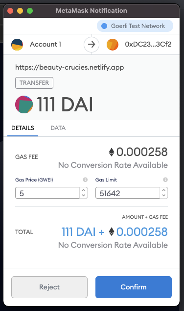
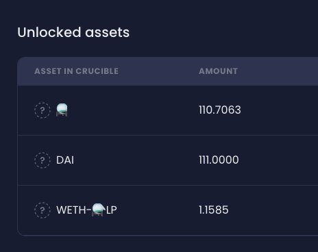

# Using your Crucible as a Smart Wallet/Vault

We've now made it easier for you to manage assets by using your Crucible via [crucible.alchemist.wtf](https://crucible.alchemist.wtf)

You can easily transfer ERC20 tokens in and out of your Crucible and use your Crucible as a Vault.

This also means moving around your assets is much easier as you can easily transfer a Crucible full of tokens to another wallet with a single transaction.

### Viewing your Crucible Contents

1. Open the "Your Crucibles" page
2. Locate the crucible you wish to interact with, and select it by clicking on it if it's not already selected. \
    \

3. The "Summary" tab should be open by default, if it's not, select it. \
    \

4. You can now view your "Locked assets" and "Unlocked assets" in a simple form.\
   \
   **Locked assets** are tokens that have been subscribed to a reward program.\
   **Unlocked Assets** are tokens sitting in your Crucible that are not subscribed to any program and are free to be transferred.\
   &#x20; \

5. Clicking on the  icon on any of your locked assets will load a menu that will let you view the Reward Program that your asset has been locked to.\

6. For unlocked assets, clicking the icon will open a menu with an opton to view the "Transfer" tab where you can move your assets around.

### Transferring in or out of your crucible

1. Open the "Your Crucibles" page
2. Locate the crucible you wish to interact with, and select it by clicking on it if it's not already selected. \
   &#x20;
3. Open the "Asset Management" tab \
    \
   \
    \
   The "Withdraw" section represents tokens within your Crucible that can be withdrawn \
   \
    \
   This represents tokens within your wallet that can be deposited to your Crucible\
   \
   You may be presented with a message instead, this would mean that you either have no unlocked tokens available for withdrawing, or you have no tokens in your wallet available for transferring to your Crucible, this may be shown as below:\
    \
   \
   Tokens subscribed to reward programs are not available for withdrawal, you can view all your locked tokens on the "Summary" tab as described in [Viewing your Crucible Contents](using-your-crucible-as-a-smart-wallet-vault.md#viewing-your-crucible-contents).\

4. If withdrawing from your Crucible, click the "Withdraw" option. **For Depositing to your Crucible, please skip to step 9.**\
    \

5. Enter the amount you wish to withdraw and click "Withdraw from Crucible" \
    \

6. Confirm the transaction.\
    \

7. You will receive a confirmation once this process has been successful.\

8. The token you have transferred will now be in your wallet.\

9. If depositing tokens into your Crucible, select the "Deposit" option. **For Withdrawing from your Crucible, please go back to step 4.**\
   ****\

10. Enter the amount you would like to deposit and click 'Deposit to Crucible'\
     **** \
    ****
11. Confirm the transaction\
     **** \
    ****
12. The token will now be transferred into your Crucible and can be viewed in the 'Summary' tab. \
    &#x20;
