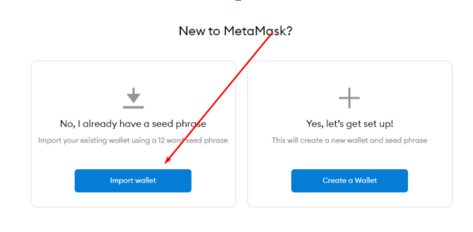
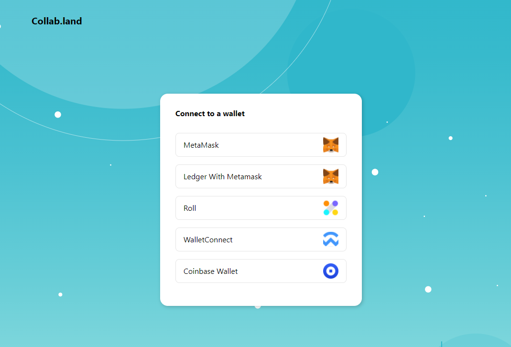
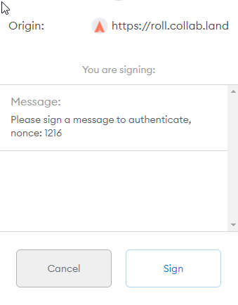
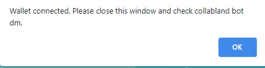
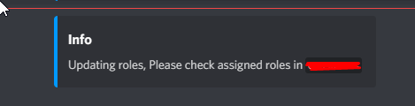

# How to Become a "Crucible Holder" on Discord


Learn how to Mint a Crucible here: [**https://docs.alchemist.wtf/crucible/guides-1/how-do-i-mint-a-crucible**](https://docs.alchemist.wtf/crucible/guides-1/how-do-i-mint-a-crucible)****


If you own a Crucible, you can become a 'Crucible Holder' in our [Discord channel](https://discord.com/invite/qWQQMMKjKe) 🧙‍♂️⚗️. One perk of becoming a Crucible Holder is that it allows you to take part in discord votes and competitions.

If your Crucible was minted using the online site, please jump to [**Part 2**](how-to-become-a-crucible-holder-on-discord.md#part-2)****

If your Crucible was minted using [command line](https://github.com/alchemistcoin/alchemist), you need to log into a new MetaMask account using the mnemonics from your command line wallet. This is shown in [**Part 1**](how-to-become-a-crucible-holder-on-discord.md#part-1)****

## **Part 1**

1. In your new MetaMask wallet, import your seed phrase (mnemonics) obtained when creating your wallet using command line &#x20;

## **Part 2**

After you have gained access to the wallet containing your Crucible, you can become a 'Crucible Holder' following these steps:

1. Join the [Alchemist discord server](https://discord.alchemist.wtf)
2. On the [#verify-roles](https://discord.gg/hsSH5gB4c4) channel locate the message by `Collab.Land` called `Verify your assets`.
3. Click the `Let's go!` button and a new page on your browser will be opened 
4. Select the wallet your Crucible is in\
   
5. Sign a message\
   
6. You will see the following message and can now return to Discord\
   
7. Collab.Land will send you the following message and if you really own a Crucible the bot will update your role\
   
8. The font color of your name should now be the color red on the Discord chat screen, assuming you have no other roles
9. If you left click on your Discord name you should see the role ⚗️ Crucible Holder circled in red\
   
10. Congratulations, your now a Crucible Holder! 🧙‍♂️⚗️
