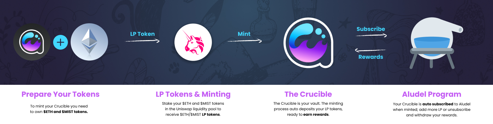
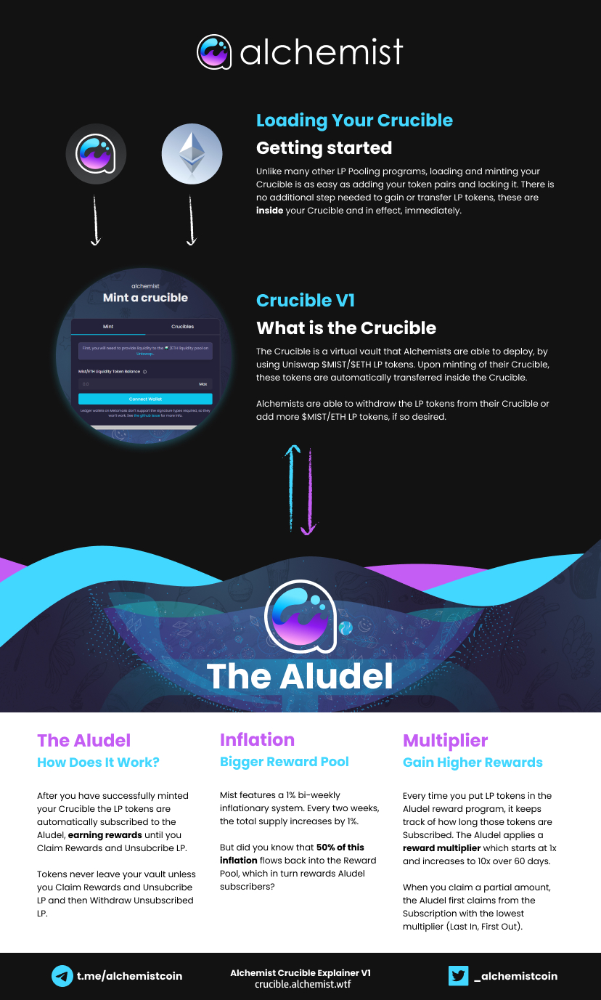

# Visual Guides

### **Videos 🎬📺**


References to Uniswap in the videos may be outdated. Please make sure you are using **Uniswap V2** for providing Liquidity when establishing MIST-WETH LP as V3 is not supported.

If you are unsure how to switch between V3 and V2, please use our links in the [guide](broken-reference).


* [Alchemist YouTube Channel](https://www.youtube.com/channel/UCIs4LugynLei2TN\_\_lJh-6Q)
* [How to Mint a Crucible](https://www.youtube.com/watch?v=8d80d1vigQw\&ab\_channel=AlchemistVideo)
* [Impermanent Loss - watch before staking LP](https://www.youtube.com/watch?v=8XJ1MSTEuU0)
* (old website) [Make a Crucible](https://www.youtube.com/watch?v=Rl9Rf-3Sp-8)
* (old website) [Get LP, then Make a Crucible](https://www.youtube.com/watch?v=Ga1qcQ6x3as)
* (old website) [Get LP, then Make a Crucible, and become a Certified Alchemist on Discord](https://www.youtube.com/watch?v=k7MO1QpqCds)
* (old website) [Crucible Transfer using Alchemist website and OpenSea.io](https://www.youtube.com/watch?v=i2MCYimelBM)

### **Images 🖼🎨**&#x20;

